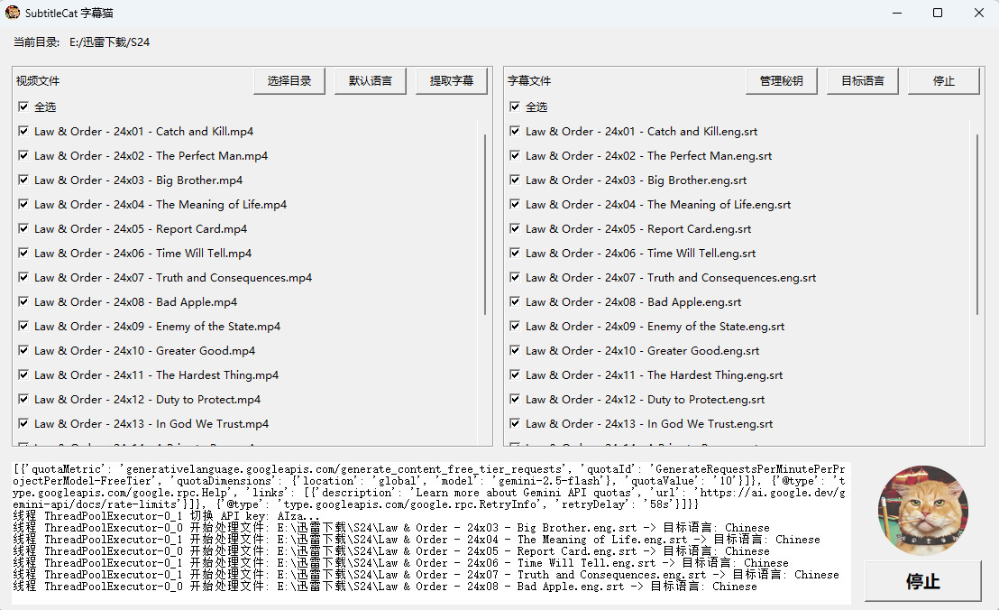

# SubtitleCAT

[](https://github.com/TestersNightmare/SubtitleCAT/releases)
[](https://opensource.org/licenses/MIT)

An SRT subtitle translation tool based on Google Gemini. Extract subtitles from videos, translate them using AI, and generate bilingual ASS files—all in a user-friendly GUI built with Tkinter.

<div style="display: flex; justify-content: center;">
  
</div>

## ✨ Features

- **Subtitle Extraction**: Automatically extract SRT subtitles from MP4/MKV videos using FFmpeg, supporting multiple language streams (e.g., English by default).
- **AI-Powered Translation**: Translate subtitles to Chinese, English, Korean, or Japanese using Google Gemini (gemini-2.5-flash). Handles batch processing with consistent terminology.
- **Bilingual ASS Output**: Generate Advanced SubStation Alpha (.ass) files with original and translated text side-by-side.
- **Recursive Directory Scanning**: Scan subdirectories for video and SRT files.
- **One-Click Workflow**: Extract, translate, and export with a single button—perfect for bulk processing.
- **API Key Management**: Securely manage multiple Google API keys with automatic failover and rate-limit handling (e.g., 503/429 errors).
- **Enhanced UI**: Modern Tkinter interface with animations, scrollable lists, and real-time logging.
- **Cross-Platform**: Python-based core; Windows EXE available for easy deployment.

## 🚀 Quick Start

### For End Users (Windows)
1. Download the latest release from [Releases](https://github.com/TestersNightmare/SubtitleCAT/releases).
2. Extract `SubtitleCat.exe` to a folder.
3. Run `SubtitleCat.exe`.
4. Add your Google Gemini API keys via **API Key** button.
5. Select a directory, choose default languages, and hit **One-Click Translate**!

### For Developers (Python)
1. Clone the repo:
   ```bash
   git clone https://github.com/TestersNightmare/SubtitleCAT.git
   cd SubtitleCAT
   ```
2. Install dependencies:
   ```bash
   pip install -r requirements.txt
   ```
3. Run the app:
   ```bash
   python geimini.py
   ```

## 📋 Requirements

- **Python 3.8+**
- **FFmpeg**: Required for subtitle extraction (download from [ffmpeg.org](https://ffmpeg.org/download.html) and add to PATH).
- **Dependencies** (see `requirements.txt`):
  ```
  pillow
  pysrt
  google-generativeai
  tkinter  # Built-in with Python
  ```

Create an `api_keys.json` file in the project root with your Google Gemini API keys (array format):
```json
[
  "your-api-key-1",
  "your-api-key-2"
]
```
Get keys from [Google AI Studio](https://aistudio.google.com/app/apikey).

## 🛠️ Building the Windows EXE

Use PyInstaller to package the app into a standalone executable:

```bash
pyinstaller -F -w -i logo.ico --name SubtitleCat --add-data "logo.png;." --add-data "api_keys.json;." --hidden-import=google.generativeai --hidden-import=pysrt geimini.py
```

- Output: `dist/SubtitleCat.exe`
- **Tips**: 
  - Ensure FFmpeg is in PATH before running the EXE.
  - For smaller size: Add `--upx-dir /path/to/upx` (UPX compressor).
  - Debug issues: Remove `-F` for a folder build or `-w` to show console.

## 📖 Usage Guide

1. **Select Directory**: Click **Choose Directory** to scan for videos (MP4/MKV) and subtitles (SRT/ASS) recursively.
2. **Set Defaults**:
   - **Default Language**: Choose subtitle streams (e.g., 'eng') via the dialog.
   - **Target Language**: Select output language (default: Chinese).
3. **Extract Subtitles**: Select videos and click **Extract Subtitles**. SRT files are saved alongside videos.
4. **Translate**: Select SRT files and click **Translate Subtitles**. Generates `.Dex7er.EN.CN.ass` files.
5. **One-Click Magic**: For full automation, use **One-Click Translate**—extracts then translates all selected videos.

**Pro Tips**:
- Monitor the log pane for progress/errors.
- Handles rate limits: Switches keys on 503 errors; waits 31s on 429.
- Supports resuming partial translations (checks existing ASS files).

## 🔧 Development

- **Core Files**:
  - `geimini.py`: Main Tkinter GUI.
  - `translate.py`: Gemini translation logic with pysrt and threading.
- **Customization**:
  - Edit `ASS_HEADER` in `translate.py` for subtitle styles.
  - Add languages to `language_map` in `geimini.py`.
- **Testing**: Run unit tests (if added) or manually test with sample videos.

## 🤝 Contributing

Pull requests welcome! For major changes, please open an issue first.

1. Fork the repo.
2. Create a feature branch (`git checkout -b feature/amazing-feature`).
3. Commit changes (`git commit -m 'Add amazing feature'`).
4. Push (`git push origin feature/amazing-feature`).
5. Open a Pull Request.

## 📄 License

This project is licensed under the MIT License - see the [LICENSE](LICENSE) file for details.

## 🙏 Acknowledgments

- Built with [Tkinter](https://docs.python.org/3/library/tkinter.html), [PySRT](https://github.com/byroot/pysrt), and [Google Generative AI](https://ai.google.dev/).
- Icons and UI inspired by modern design principles.

---

⭐ **Star this repo if it helps your subtitle workflow!** Questions? Open an issue.